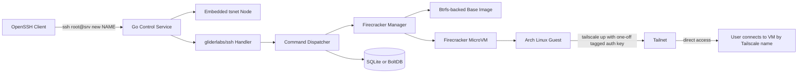
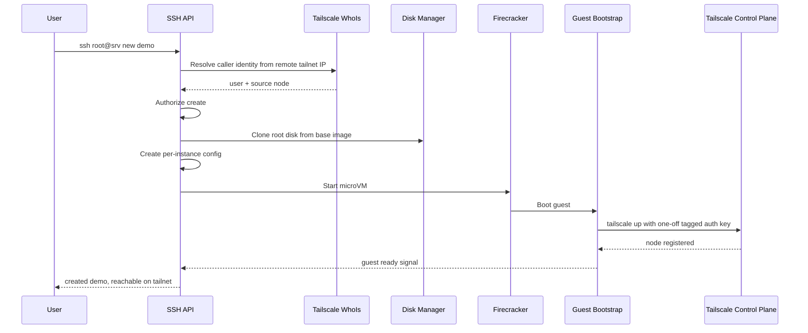

# Self-Hosted MicroVM Service Plan

## Goal

Build a self-hosted Go service that is reachable on a tailnet as `srv` and uses SSH as its control API.

Primary user experience:

```bash
ssh root@srv new <name>
```

That command should:

1. Reach the control-plane service over Tailscale.
2. Execute `new <name>` as an SSH command, not as a shell login.
3. Create a Firecracker microVM from an Arch Linux base image.
4. Give the VM writable storage cloned from a Btrfs-backed base image store.
5. Have the guest join the user's tailnet automatically.
6. Return once the VM is reachable on Tailscale.

The VM should become a real Tailscale node in the tailnet, not just a process hidden behind the host.

## First-Version Principles

## 1. Native Tailscale Identity From Day 1

Version 1 will use this model immediately:

- Restrict access to `srv:22` with Tailscale ACLs.
- Treat SSH as transport, not primary identity.
- Derive caller identity from Tailscale connection metadata.
- Use Tailscale `WhoIs` data for authorization, audit, and policy decisions.

This means the service does **not** rely on SSH public keys as its source of truth.

## 2. Smallest Reliable VM Path

Version 1 will optimize for reliable provisioning, not feature breadth.

- One control-plane binary.
- One known-good Arch guest image.
- One VM creation path.
- One network model.
- One metadata store.

## 3. Host Btrfs First

Version 1 will use Btrfs on the host for cloning and snapshots.

Guest root-on-Btrfs is optional and should not block the MVP. If it proves easy with the chosen Arch build, it can stay. If it slows down bring-up, guest root can be ext4 while host storage remains Btrfs.

The key requirement is fast clone-on-create, and host-side Btrfs already solves that.

## Product Shape

The system has two layers:

- Control plane: a Go process that joins the tailnet as `srv`.
- Worker plane: Firecracker microVMs running on the same host.

Users interact only with the control plane at creation time. After a VM is created, they connect directly to the VM over Tailscale.

## High-Level Architecture



## Main Components

## 1. Embedded Tailscale Node

Use `tailscale.com/tsnet`.

Why:

- The service becomes its own Tailscale node.
- No dependency on a separately managed `tailscaled` just to expose the control API.
- No port `22` conflicts with host SSH or Tailscale SSH.
- The service can listen directly on the tailnet.

Planned role:

- Join the tailnet as `srv`.
- Listen on tailnet TCP port `22`.
- Provide access to the in-process LocalAPI so the service can resolve caller identity from connection source IPs.

## 2. SSH Command API

Use `github.com/gliderlabs/ssh`.

Why:

- It treats SSH commands like direct handler calls.
- It does not require launching a shell.
- `ssh root@srv new demo` arrives as a command vector like `[]string{"new", "demo"}`.

Planned behavior:

- Disable PTY requirements for control commands.
- Reject shell sessions.
- Accept only `exec` requests.
- Return stdout/stderr/exit status as the API response surface.

## 3. VM Lifecycle Manager

Use Firecracker through `firecracker-go-sdk` unless direct process execution proves significantly simpler during bring-up.

Why the SDK is the default choice:

- Better lifecycle control from Go.
- Cleaner ownership of sockets, logs, drives, and machine metadata.
- Easier future extension into snapshots and vsock.

Version 1 should avoid overcomplicating networking and use a simple TAP-based model.

## 4. Disk/Image Manager

Use host-side Btrfs subvolumes or reflinked files to hold:

- a read-mostly base image artifact
- per-instance cloned writable root disks
- optional snapshot points for debugging and rollback

The core requirement is:

- VM creation must be fast enough that `new <name>` feels interactive.

## 5. Guest Bootstrap

The guest image should contain a first-boot bootstrap path that:

1. reads per-instance configuration
2. configures hostname
3. starts `tailscaled`
4. runs `tailscale up` with a one-off auth key
5. deletes the bootstrap secret after use
6. reports readiness

## Version 1 Auth Model

## Decision

Version 1 will use **Model B** immediately:

- network access is controlled by Tailscale ACLs
- identity is taken from Tailscale peer information
- SSH credentials are not trusted as the user identity

## Practical Consequence

The SSH connection still exists because the client is `ssh`, but the service should interpret the caller as:

- the Tailscale user identity behind the source node
- the Tailscale node that originated the connection

not as:

- the SSH username alone
- an SSH public key alone

The `root` in `ssh root@srv ...` becomes a routing convenience for the SSH client UX, not the security boundary.

## How Identity Resolution Works

1. Incoming SSH connection arrives on the `tsnet` listener.
2. The service obtains the remote address from the accepted `net.Conn`.
3. The service calls Tailscale LocalAPI `WhoIs` on that remote address.
4. The returned user profile and node identity become the authenticated actor.
5. Authorization logic uses those values.
6. All audit logs record those values.

Example data to record per request:

- Tailscale user login
- Tailscale user display name
- source node name
- source node tailnet IP
- requested command
- VM target name
- result and timing

## Important Compatibility Note

Standard OpenSSH clients still expect an SSH handshake.

To preserve the Model B goal without overfitting to unusual client behavior, the transport layer should do one of these:

- accept SSH `none` auth if the client supports it cleanly
- otherwise accept a minimal dummy auth method and ignore it for identity

Identity must still come from Tailscale `WhoIs`, not from SSH auth state.

If client interoperability with `none` auth is inconsistent, the fallback should be:

- allow any password or any public key at the SSH transport layer
- perform real authorization only after resolving Tailscale identity

That preserves the architectural intent while keeping the UX as `ssh root@srv ...`.

## Authorization Model

Authorization should be explicit in-app even though network access is already restricted by ACLs.

Version 1 policy can be simple:

- allow a configured list of Tailscale users or groups to create VMs
- optionally map Tailscale tags or groups to allowed operations

Suggested rule categories:

- `create`
- `list`
- `inspect`
- `delete`
- `start`
- `stop`

This gives defense in depth:

- Tailscale decides who can reach `srv:22`
- the app decides what those callers can do

## Tailscale Setup

## Control Plane Node

The control-plane process should join the tailnet as `srv` using `tsnet`.

Recommended config:

- persistent state directory
- stable hostname `srv`
- not ephemeral
- optionally a tag like `tag:microvm-control`

## Tailnet ACL Direction

The intended security model is:

- only approved users/devices can reach `srv:22`
- the control-plane node can create guest auth keys using a scoped OAuth client
- newly created guests receive a narrow tag such as `tag:vm`

Representative policy shape:

```json
{
  "tagOwners": {
    "tag:microvm-control": ["autogroup:admin"],
    "tag:vm": ["tag:microvm-control"]
  },
  "grants": [
    {
      "src": ["group:vm-admins"],
      "dst": ["tag:microvm-control"],
      "ip": ["22"]
    },
    {
      "src": ["group:vm-admins"],
      "dst": ["tag:vm"],
      "ip": ["*"]
    }
  ]
}
```

The exact policy depends on your tailnet structure, but this is the intended boundary.

## Guest Join Strategy

The host should hold the durable Tailscale trust credential.

The guest should receive only a short-lived credential for first boot.

Recommended flow:

1. The control service authenticates to Tailscale using an OAuth client with the minimum required capability to create auth keys.
2. For each new VM, the service creates a one-off auth key.
3. The auth key is tagged and preauthorized.
4. The key is injected into the guest only for bootstrap.
5. The guest runs `tailscale up --auth-key=...` once.
6. The key is discarded.

Do **not** put the OAuth client secret itself into the guest.

## VM Provisioning Flow

## User Command Flow

```text
ssh root@srv new demo
```

## Control-Plane Sequence



## Guest Naming

The requested `<name>` should be used consistently across:

- control-plane metadata
- guest hostname
- Tailscale node name when possible
- log prefixes
- disk paths

Name validation should be strict and simple:

- lowercase letters
- digits
- hyphen
- limited maximum length

## Storage Plan

## Host Layout

Suggested host storage layout:

```text
/var/lib/srv/
  state/
    app.db
    tsnet/
  images/
    arch-base/
      kernel
      initramfs
      rootfs-base.img
      manifest.json
  instances/
    demo/
      rootfs.img
      config.json
      firecracker.socket
      firecracker.log
      serial.log
      meta.json
```

## Btrfs Usage

Preferred strategies:

- Use Btrfs reflinks for fast file cloning if using raw image files.
- Or use Btrfs subvolumes if the image build pipeline maps cleanly to subvolume snapshots.

For version 1, the simpler operational model should win.

If raw image files plus reflinks are easier to reason about than subvolumes, prefer that first.

## Guest OS Plan

## Base Image Contents

The Arch base image should include:

- kernel compatible with Firecracker guest requirements
- initramfs if needed by the build approach
- `systemd`
- `tailscale`
- `openssh` only if you want direct SSH after boot
- minimal network tooling
- bootstrap service and script

## First-Boot Units

Recommended guest units:

- `srv-bootstrap.service`
- `tailscaled.service`
- optional `sshd.service`

Bootstrap responsibilities:

- mount or read instance config
- set hostname
- configure root or admin access if needed
- start Tailscale
- join tailnet
- mark success locally

## Networking Plan

## Version 1 Networking

Keep networking simple:

- one TAP device per VM
- host-side NAT/masquerade for outbound internet access
- no inbound port publishing through the host

This is enough because the guest will run Tailscale itself.

Once joined to the tailnet, the guest becomes reachable directly by its Tailscale address and name.

## Why This Is Enough

The host does not need to proxy SSH, HTTP, or TCP into the guest.

The host only needs to provide bootstrap connectivity so the guest can:

- reach the Tailscale control plane
- establish peer or DERP connectivity
- install packages if that remains part of first boot

## Metadata Store

Use SQLite first.

Why:

- good enough for a single-node service
- transactional
- easy to inspect
- handles concurrency better than ad hoc files

Suggested tables:

- `instances`
- `instance_events`
- `commands`
- `authz_decisions`

Suggested `instances` fields:

- `id`
- `name`
- `state`
- `created_at`
- `created_by_user`
- `created_by_node`
- `rootfs_path`
- `firecracker_pid`
- `tailscale_name`
- `tailscale_ip`
- `last_error`

## Command Surface

Version 1 command set:

- `new <name>`
- `list`
- `inspect <name>`
- `delete <name>`

Strong candidate commands for the same milestone if cheap:

- `start <name>`
- `stop <name>`
- `logs <name>`

Example outputs:

```text
$ ssh root@srv new demo
created: demo
state: provisioning
tailscale: waiting for guest join
```

```text
$ ssh root@srv new demo
created: demo
state: ready
tailscale-name: demo
tailscale-ip: 100.x.y.z
connect: ssh root@demo
```

## Logging And Audit

Every command should emit an audit record with:

- timestamp
- caller Tailscale user
- caller source node
- remote tailnet IP
- command
- arguments
- authorization result
- VM ID or name
- success or failure
- duration

This matters more in Model B because SSH auth is intentionally not the identity source.

## Error Handling

`new <name>` must fail clearly and predictably.

Examples:

- name already exists
- caller not authorized
- base image missing
- Btrfs clone failed
- Firecracker start failed
- guest never joined Tailscale before timeout

The service should distinguish between:

- creation failed and no cleanup was needed
- creation failed after partial resource allocation
- creation succeeded but guest readiness timed out

In the last case, the instance should remain inspectable for debugging.

## Security Notes

## Control Service Privilege

The control service is highly privileged because it needs:

- `/dev/kvm`
- VM disk access
- TAP creation or network setup
- Firecracker process management

This should be treated as root-equivalent infrastructure.

## Secrets Handling

Do not:

- store reusable guest join credentials in the image
- persist short-lived auth keys in logs
- expose OAuth secrets to the guest

Do:

- mint one-off keys per VM
- scrub them after use
- redact them from command output and logs

## Recommended Build Order

## Phase 1: Control Plane Skeleton

- create Go binary
- embed `tsnet`
- expose SSH server on tailnet port `22`
- implement command dispatch
- resolve caller identity with `WhoIs`
- log and authorize commands

Success criteria:

- `ssh root@srv list` reaches the service and returns an empty list
- logs show resolved Tailscale caller identity

## Phase 2: Firecracker Bring-Up

- boot one manually prepared Arch microVM
- capture serial logs
- confirm stable kernel/rootfs combo
- confirm outbound network access from guest

Success criteria:

- a known-good guest boots repeatably from local artifacts

## Phase 3: Disk Cloning And Instance Records

- create instance record in SQLite
- clone root disk from base image using Btrfs
- generate per-instance config

Success criteria:

- `new demo` produces a unique on-disk instance directory and database record

## Phase 4: Guest Tailnet Join

- mint one-off guest auth key from the host
- inject bootstrap config into guest
- join tailnet automatically
- wait for guest readiness

Success criteria:

- `new demo` returns a Tailscale-reachable VM

## Phase 5: Lifecycle And Cleanup

- add `inspect`
- add `delete`
- add cleanup for failed creates
- add log surfaces

Success criteria:

- stale resources do not accumulate silently

## Open Decisions

These should be resolved early, but they do not block the architecture.

## 1. Guest Root Filesystem Format

Decision target:

- ext4 guest root for MVP, or true Btrfs guest root now

Recommendation:

- keep host Btrfs mandatory
- allow guest ext4 if it materially reduces boot complexity

## 2. Bootstrap Transport

Decision target:

- mutate cloned disk directly
- attach config drive
- use Firecracker MMDS

Recommendation:

- start with direct disk mutation or config drive
- move to MMDS later if it clearly improves cleanliness

## 3. Transport Auth Fallback

Decision target:

- can OpenSSH connect cleanly with server-side `none` auth acceptance in the chosen stack?

Recommendation:

- test first
- if interoperability is messy, accept minimal dummy SSH auth and continue using Tailscale `WhoIs` as the real identity source

## Non-Goals For Version 1

- multi-host scheduling
- cluster orchestration
- shared image registry
- snapshots as a user feature
- nested tenancy
- OCI image execution inside guests
- host-to-guest service publishing beyond Tailscale join

## Final Recommendation

Build version 1 as a single-node, Tailscale-native control plane with:

- `tsnet` for the `srv` node
- `gliderlabs/ssh` for command transport
- Tailscale `WhoIs` as the actual identity source
- Firecracker for VM lifecycle
- host-side Btrfs for fast cloning
- guest-side Tailscale join via one-off host-minted auth keys

This gives the target UX immediately:

```bash
ssh root@srv new demo
```

and keeps the identity model aligned with the tailnet from the first release instead of bolting it on later.
